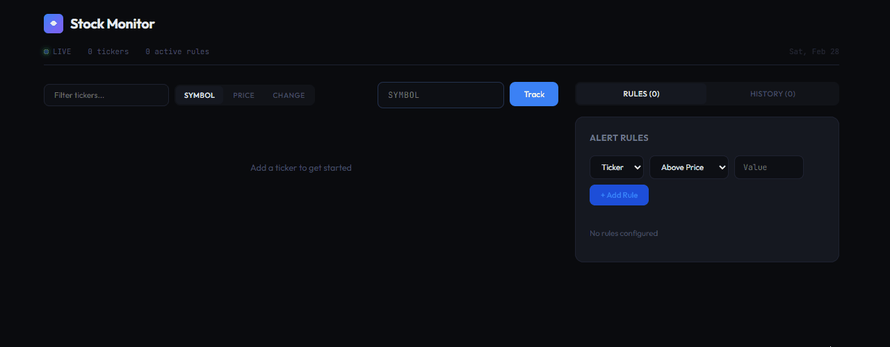

# 📈 Stock Monitor — Real-Time Alerting Platform

A full-stack, dockerized stock monitoring system that tracks tickers, evaluates alert rules, and streams real-time updates via WebSockets and Discord notifications.

Built to simulate a production-style alerting backend with polling, rule evaluation, persistence, and event broadcasting.

---

## 🎬 Live System Demonstration

<p align="center">
  
</p>

---

## 🚀 Features

- REST API for managing tickers and alert rules
- Real-time price polling engine
- Rule evaluation with cooldown protection
- WebSocket server for live dashboard updates
- Discord webhook alert integration
- PostgreSQL + Prisma ORM with migrations
- Fully Dockerized (frontend, backend, database)
- Environment-based configuration

---

## 🏗 Architecture

```
React (Vite) → Nginx
        ↓
Express API + WebSocket Server
        ↓
Prisma ORM
        ↓
PostgreSQL
```

### Background Polling Service

- Fetches latest price data
- Stores price history
- Evaluates alert rules
- Triggers notifications
- Broadcasts updates via WebSocket

---

## 🛠 Tech Stack

### Backend
- Node.js
- Express
- Prisma ORM
- PostgreSQL
- WebSockets
- Zod (validation)

### Frontend
- React
- TypeScript
- Vite
- Nginx (containerized build)

### Infrastructure
- Docker
- Docker Compose

---

## ⚙️ Local Development

### 1️⃣ Clone the repository

```bash
git clone https://github.com/StuartAriza/Stock-Monitor.git
cd Stock-Monitor
```

### 2️⃣ Configure environment variables

```bash
cp .env.example .env
```

Edit values if needed.

### 3️⃣ Start the application

```bash
docker compose up --build
```

---

## 🌐 Access the App

Frontend:  
http://localhost:5173

Backend API:  
http://localhost:3001

---

## 🔐 Environment Configuration

All sensitive values are managed via environment variables.

See `.env.example` for required configuration fields.

Never commit real API keys or webhook URLs.

---

## 📌 Future Improvements

- [ ] Multi-user authentication  
- [ ] Real market API integration  
- [ ] Historical chart visualization  
- [ ] Rate limiting & caching  
- [ ] Cloud deployment  
- [ ] Monitoring & logging enhancements  

---

## 📄 License

This project is for portfolio and educational purposes.

